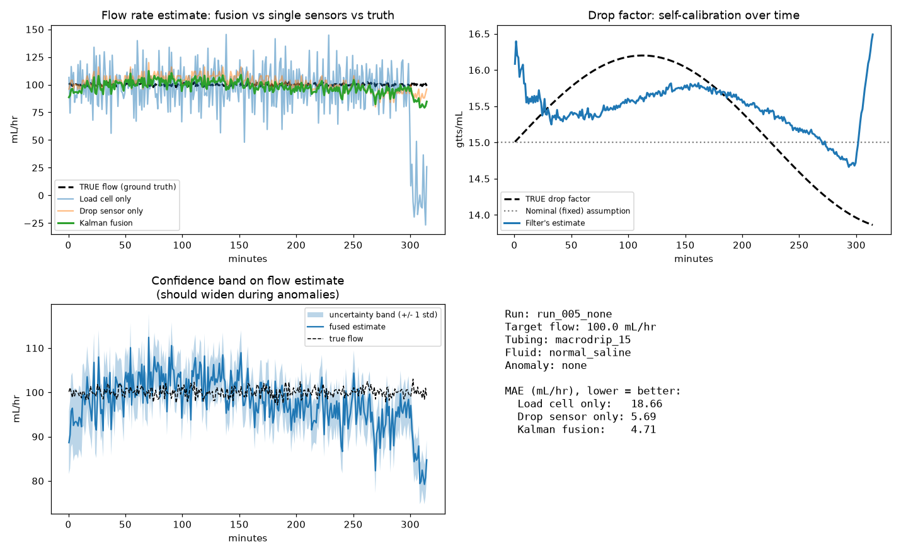

# IV Drip Monitoring — Dual-Sensor Kalman Fusion

A gravity-fed IV infusion monitoring system that fuses two low-cost sensors — a **load cell** (weighs the fluid bag) and an **IR drop counter** (counts individual drops through the drip chamber) — into a single, more accurate flow-rate estimate using an **Extended Kalman Filter (EKF)**. The system self-calibrates the tubing's drop factor over time and reports a remaining-time-to-empty prediction with a statistically derived confidence interval.

## Why fuse two sensors?

A load cell alone is sensitive to vibration and patient movement. A drop counter alone assumes a fixed, printed drop factor (e.g. "15 gtts/mL") that in reality drifts with fluid viscosity and temperature. Fusing them — and letting the filter learn the true drop factor instead of trusting the printed one — is the core idea behind this system.

## How it works

1. **Sensing layer** — a load cell samples bag weight at 1 Hz; an IR sensor timestamps each drop.
2. **Windowing** — raw samples are grouped into fixed time windows (default 60 s). Each window yields two independent measurements: flow rate implied by weight loss, and raw drop rate implied by drop count.
3. **Fusion layer** — an EKF maintains a 2-element state `[flow_rate, drop_factor]` and fuses both measurements every window. The drop sensor's measurement (`drop_rate = flow_rate × drop_factor`) is a nonlinear product of both state variables, which is why an *Extended* Kalman filter (with a linearizing Jacobian) is used instead of a standard linear one.
4. **Output** — a fused flow-rate estimate, a self-calibrating drop-factor estimate, and a remaining-time prediction with a confidence interval that widens automatically when the two sensors disagree.

## Repository contents

| File | Purpose |
|---|---|
| `kalman_filter_iv.py` | Core EKF implementation (`IVFusionEKF`) — loads sensor data, fuses it window-by-window, and produces flow rate, drop factor, and remaining-time estimates. |
| `generate_synthetic_data.py` | Physics-grounded synthetic sensor data generator used to validate the fusion approach — simulates a gravity IV session including weight loss, individual drop timing, sensor noise, and occlusion/leak events. |
| `run_demo.py` | Runs and evaluates the filter on one session: prints an MAE/RMSE accuracy table and saves a results plot. |
| `live_demo.py` | Streams a session window-by-window in real time with a live-updating plot, demonstrating genuine online estimation (no look-ahead). |
| `live_monitor.py` | A bedside-monitor-style live terminal interface with a status flag (Normal / Monitoring / Check Line / Infusion Complete). |
| `compare_runs.py` | Before/after comparison tool for demonstrating the effect of changing a simulation parameter (flow rate, drop factor, fluid, anomaly type). |
| `synthetic_dataset/` | 20 simulated sessions (12 normal, 4 occlusion, 4 leak) spanning 5 flow rates, 4 drop-factor tubing types, and 3 fluids, used for validation. |
| `IV_Drip_Monitoring_Report.pdf` | Full project report (implementation, results, outcome, novelty assessment). |

## Getting started

```bash
pip install numpy pandas matplotlib

# Full accuracy report + plot for one session
python run_demo.py

# Live, window-by-window streaming demo
python live_demo.py

# Bedside-monitor-style live terminal UI
python live_monitor.py

# Regenerate the synthetic validation dataset
python generate_synthetic_data.py

# Before/after "what if I change X" comparison plot
python compare_runs.py
```

## Results

Evaluated on the physics-grounded synthetic validation dataset (18 sessions: normal, occlusion, leak):

| Method | MAE (mL/hr) |
|---|---|
| Load cell only | 20.94 |
| Drop sensor only | 6.46 |
| **Kalman fusion (this system)** | **5.92** |

The fused estimate outperforms the better single sensor across every scenario tested, including both anomaly types, and the drop-factor state tracks the true drifting tubing value instead of staying pinned to the fixed nominal rating.



See `IV_Drip_Monitoring_Report.pdf` for the full write-up.
